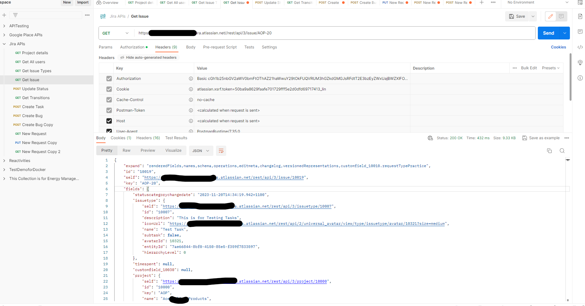
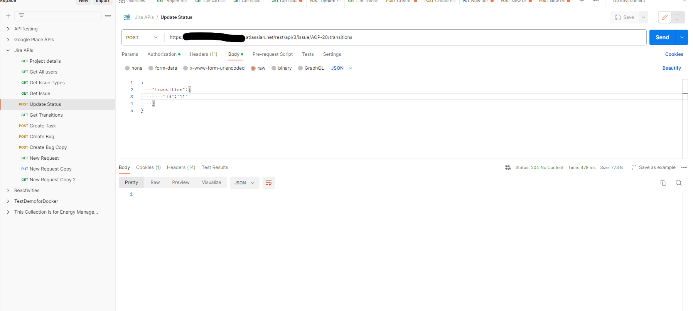
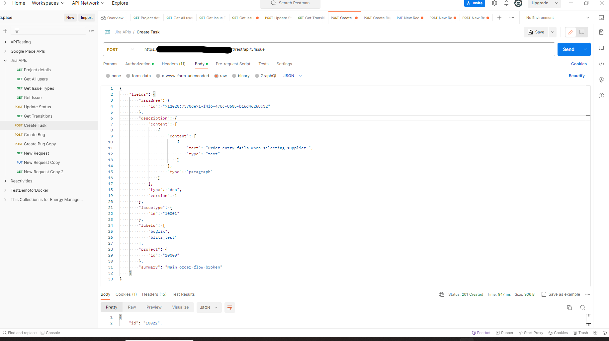
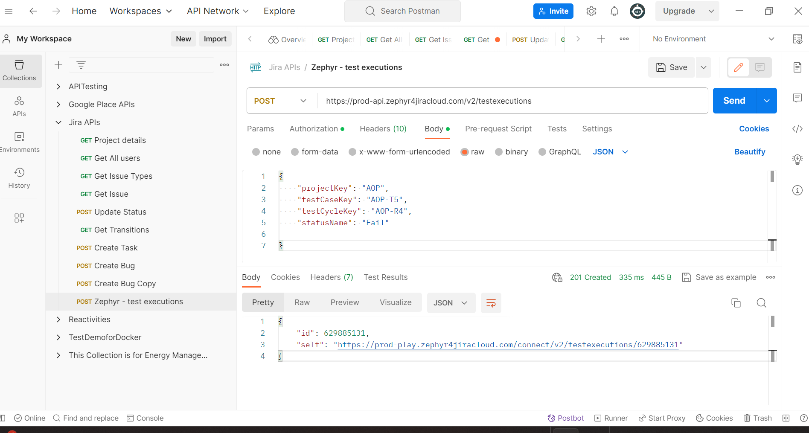
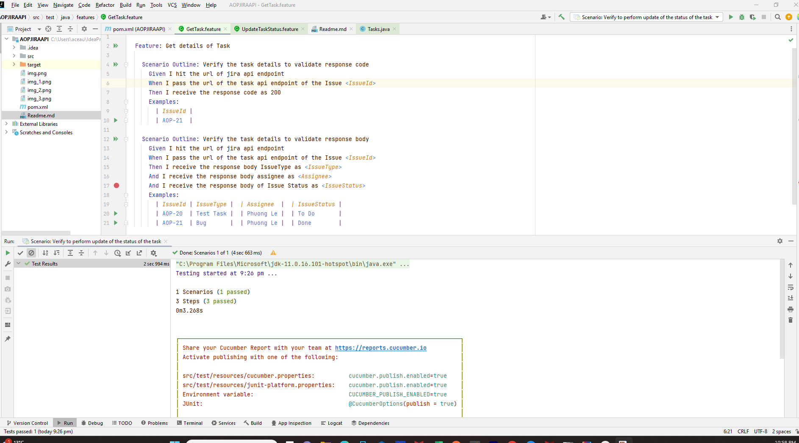

<h1 align="center"> Automation of Atlassian Jira & Zephyr apis - sample project to use some market available apis  </h1>  

  Description: This is a demo project on java tech for testing and performing GET and POST on apis on Tasks of jira 

## Table of Contents

- [Introduction](#introduction)
- [Features](#features)
- [Requirements](#requirements)
- [Quick Start](#quick-start)

## Introduction

## Manual Verification:

perform GET API - validate response code and response body
GET

POST API- validate response code and response body - to update the status of the Task
POST:

POST API- validate response code and response body - to create a Task
PUT:

POST API - test executions of Zephyr

## Features
Get Task: GET API
UpdateStatusTask: POST API
PostStatus Task: Zephyr API

## Test Requirements
The tests need to be validated for the response code returned back as well as the response body

### Local
* [Java 11 SDK](https://www.oracle.com/au/java/technologies/javase/jdk11-archive-downloads.html)
* [Maven](https://maven.apache.org/download.cgi)
* [ChromeDriver](https://chromedriver.chromium.org/downloads)

## Execution modes ## 🤖 Starting up

!

## Reporting

